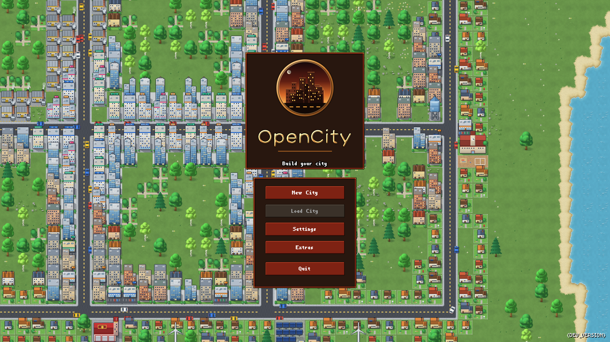
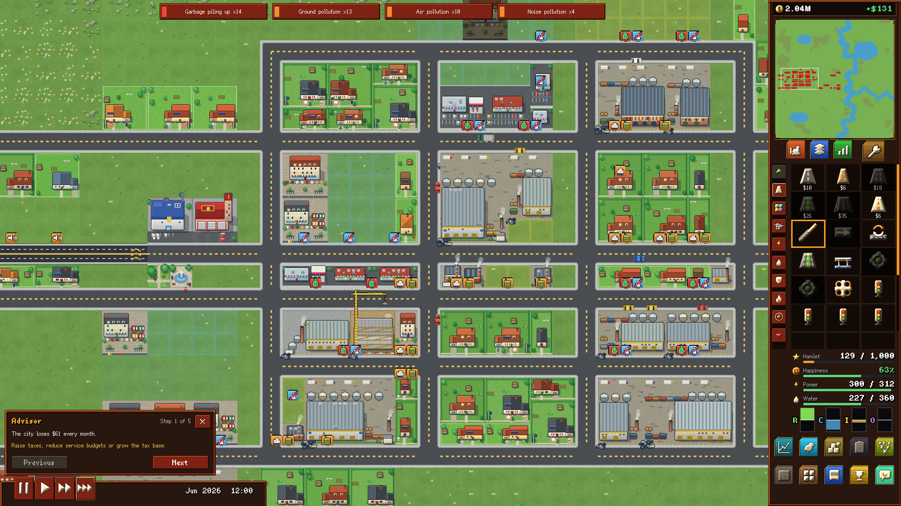
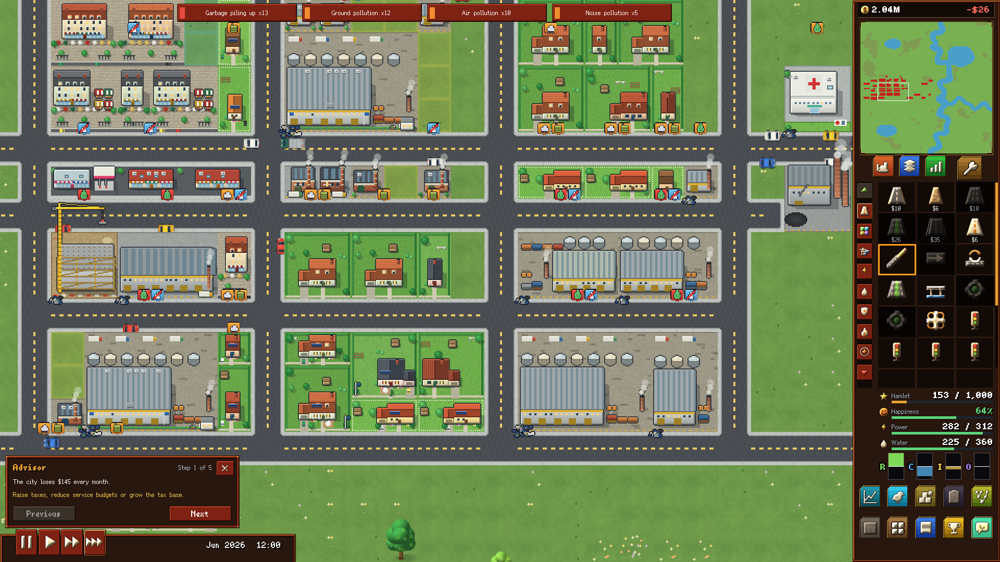
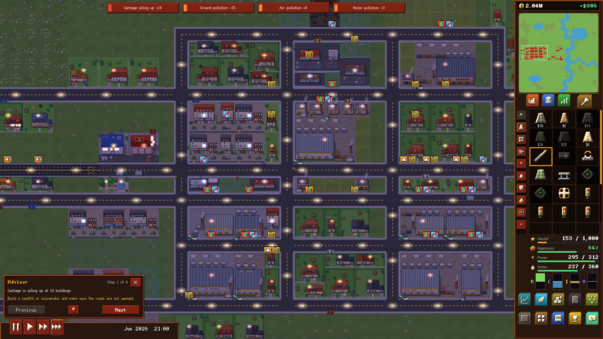
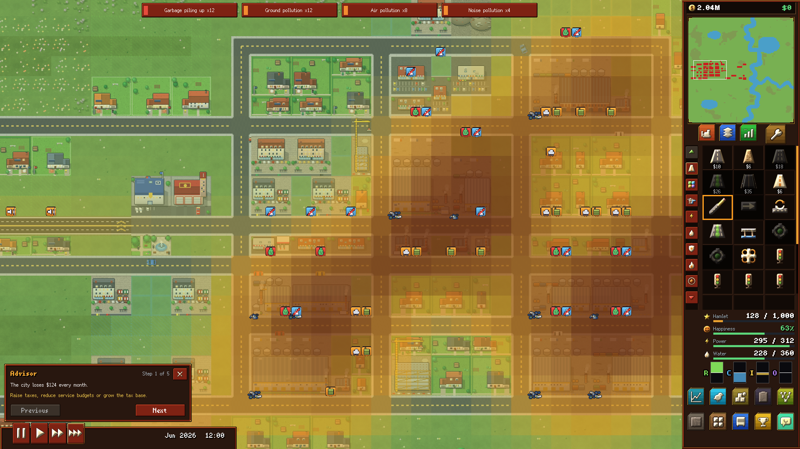

# OpenCity

A Cities: Skylines 2-style city builder with a Dune 2000-style interface, built on the
[OpenRA](https://github.com/OpenRA/OpenRA) engine.



## What it simulates

Every person, household, vehicle and company is simulated individually; the city's numbers come from them.

- **Citizens**: people age, go to school, work, shop, have children, get sick, commit crimes and move away.
  Households pay rent and spend wages. Tourists come by road and intercity train and stay in hotels.
- **Traffic**: every trip is a real vehicle on the road network. The simulation covers lanes, traffic lights,
  roundabouts, parking, accidents, bus lanes, pedestrians and level crossings.
- **Roads and utilities**: street, gravel, avenue, boulevard and highway road types. You can add trees, noise
  barriers, lights, parking, bus lanes and bike lanes, and build bridges. Power and water networks are separate.
- **Zoning and growth**: low, medium and high density, mixed-use, low-rent, office and warehouse zones. Lot
  shapes and corner lots depend on frontage, buildings level up, and building styles come in North American
  and European themes.
- **Economy**: 36 resources with production chains. Companies earn profits or go bankrupt. There is trade
  with the outside world, warehouses, taxes, fees, loans and a balanced ledger.
- **Industry**: farms, forests, ore, oil and fishing that eventually run out, plus cargo by truck, rail,
  ship and air.
- **Services**: fire, police and jail, health, deathcare, garbage, education, parks and post. Vehicles are
  dispatched to calls, and helicopters, patrols and wildfires are included.
- **Public transport**: buses, trams, metro, trains and taxis, with lines, depots, fares and ridership.
- **Environment and time**: day and night, seasons, weather, air, ground and noise pollution, and floods
  and lightning.
- **Progression**: milestones, development points, policies, districts, map tiles, signature buildings and
  achievements.
- **Interface**: info views, statistics graphs, budget and production panels, an advisor, an alert strip
  and a chirper feed.
- **Sharp pixel art at any size**: panels, buttons and icons are drawn by code at the exact screen scale, and
  text uses pixel fonts. A UI scale slider (Settings → Display) goes from 50% to 300%, and the map stays
  crisp at every zoom level (0.5× to 4×). Layouts adapt from 1280×720 up to 4K.

Simulation is fully deterministic, so a replay reproduces a game exactly.

Screenshots below are 1920×1080 at 125% UI scale.

## Screenshots

| | |
|---|---|
|  |  |
| A young city with the alert strip and advisor | Zoomed in: traffic, industry and homes |
|  |  |
| Night with street and window lights | Pollution info view |

## Build and play

Requires the [.NET 10 SDK](https://dotnet.microsoft.com/download).

```sh
make
./launch-game.sh Game.Mod=city
```

On Linux Wayland compositors, `SDL_VIDEODRIVER=wayland ./launch-game.sh Game.Mod=city` avoids X11 issues.
On Windows use `make.cmd` and `launch-game.cmd Game.Mod=city`.

Pick **New City**, choose a map (Green Valley, Lakeside or River Bend) and start building roads and zones.

## Development

- `mods/city/ARCHITECTURE.md` covers system boundaries, determinism rules and the testing workflow.
- `mods/city/design/` holds the design notes behind each system (citizens, traffic, networks, zoning,
  economy, industry, services, transit, progression, environment).
- `mods/city/tools/autotest.sh` runs a headless game from a scripted scenario. It can take screenshots, and
  it can replay a recording to check determinism:

  ```sh
  mods/city/tools/autotest.sh green-valley "ticks=12000;scenario=full;shots=6000"
  ```

- `make check` builds in Debug mode, where style warnings fail the build. `./utility.sh city --check-yaml`
  lints the mod's rules. After adding fluent messages that are looked up by computed keys, run
  `./utility.sh city --check-yaml | python3 mods/city/tools/gen_fluent_keys.py`.

## License and credits

OpenCity is free software under the GNU General Public License v3 (see [COPYING](COPYING)).

It is built on the [OpenRA](https://github.com/OpenRA/OpenRA) engine; see [AUTHORS](AUTHORS) for the
OpenRA contributors. The interface chrome is adapted from OpenRA's Dune 2000 mod. City art is generated by
the scripts in `mods/city/tools/`.

OpenCity is not affiliated with or endorsed by Colossal Order, Paradox Interactive or Electronic Arts.
